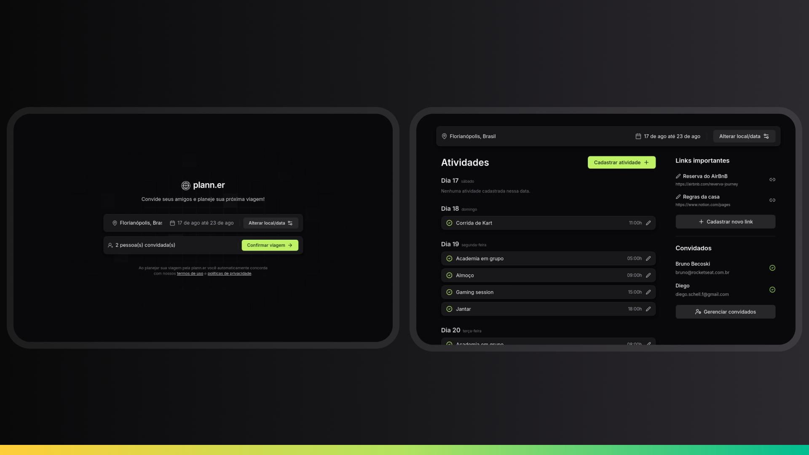

<p align="center">
  
</p>

<p align="center">
Aplicação desenvolvida no NLW Journey da Rocketseat na trilha Nodejs.
</p>

<p align="center">
  <a href="#-tecnologias">Tecnologias</a>&nbsp;&nbsp;&nbsp;|&nbsp;&nbsp;&nbsp;
  <a href="#-projeto">Projeto</a>&nbsp;&nbsp;&nbsp;|&nbsp;&nbsp;&nbsp;
  <a href="#memo-licença">Licença</a>
</p>

<p align="center">
  
</p>

<br>

<p align="center">
  
</p>


## 🛠️ Tecnologias

Esse projeto foi desenvolvido com as seguintes tecnologias:

- Fastify
- Prisma
- TypeScript
- Nodemailer
- Zod
- Dayjs

## 🚀 Projeto

O plann-er e um aplicativo de planejamento de viagens, A ferramenta permite cadastrar viagens, convidar amigos, criar atividades nessa viagem e muito mais. Back-end da aplicação desenvolvida durante o NLW Journey da Rocketseat. 

## :memo: Documentação da API

Para documentação da API, acesse o link: https://nlw-journey.apidocumentation.com/reference

## :pushpin: Routes

### Trips Routes

#### POST `/trips`

Cria uma nova viagem.

##### Request body

```json
{
  "destination": "São Paulo",
  "starts_at": "2024-08-01 18:00:00",
  "ends_at": "2024-08-04 18:00:0",
  "owner_name": "John Doe",
  "owner_email": "johndoe@gmail.com",
  "emails_to_invite": [
    "pedrodoe@gmail.com",
    "marydoe@gmail.com",
    "sarahdoe@gmail.com"
  ]
}
```

##### Response body

```json
{
  "tripId": "f944daf7-e7e6-47a2-b050-1556d6a9e963"
}
```
---
#### GET `/trips/:tripId`

Retorna os detalhes de uma viagem.

##### Response body

```json
{
  "trip": {
    "id": "f944daf7-e7e6-47a2-b050-1556d6a9e963",
    "destination": "Rio de Janeiro",
    "starts_at": "2024-08-01T21:00:00.000Z",
    "ends_at": "2024-08-04T21:00:00.000Z",
    "is_confirmed": true
  }
}
```
---
#### PUT `/trips/:tripId`

Altera uma viagem.

##### Request body

```json
{
  "destination": "Rio de Janeiro",
  "starts_at": "2024-08-01 18:00:00",
  "ends_at": "2024-08-04 18:00:0"
}
```

##### Response body

```json
{
  "tripId": "f944daf7-e7e6-47a2-b050-1556d6a9e963"
}
```
---
#### GET `/trips/:tripId/confirm`

Confirma uma viagem.

### Participants Routes

#### POST `/trips/:tripId/invites`

Envia um convite a um participante para uma viagem.

##### Request body

```json
{
  "email": "johndoe3@gmail.com"
}
```

##### Response body

```json
{
  "participantId": "f944daf7-e7e6-47a2-b050-1556d6a9e963"
}
```
---
#### GET `/trips/:tripId/participants`

Retorna os participantes de uma viagem.

##### Response body

```json
{
  "participants": [
    {
      "id": "a91c91e1-8cca-4649-88e8-91cdf143df22",
      "name": "John Doe",
      "email": "johndoe@gmail.com",
      "is_confirmed": true
    },
    {
      "id": "dce0de32-421a-4512-9580-21c75648350d",
      "name": null,
      "email": "marydoe@gmail.com",
      "is_confirmed": false
    },
    {
      "id": "d673c4eb-f39a-4de4-8617-ef23b3707693",
      "name": null,
      "email": "pedro@gmail.com",
      "is_confirmed": true
    }
  ]
}
```
---
#### GET `/participants/:participantId`

Retorna os detalhes de um participante.

##### Response body

```json
{
  "participant": {
    "id": "a91c91e1-8cca-4649-88e8-91cdf143df22",
    "name": "John Doe",
    "email": "johndoe@gmail.com",
    "is_confirmed": true
  }
}
```

#### GET `/participants/:participantId/confirm`

Confirma um participante na viagem.

---
### Activities Routes

#### POST `/trips/:tripId/activities`

Cria uma atividade em uma viagem.

##### Request body

```json
{
  "title": "Play",
  "occurs_at": "2024-08-01 18:00:00"
}
```

##### Response body

```json
{
  "activityId": "f944daf7-e7e6-47a2-b050-1556d6a9e963"
}
```
---
#### GET `/trips/:tripId/activities`

Retorna as atividades de uma viagem.

##### Response body

```json
{
  "activities": [
    {
      "date": "2024-08-01T21:00:00.000Z",
      "activities": [
        {
          "id": "6e444c9e-11b8-4b95-b5ff-73288f3c0b5e",
          "title": "Play",
          "occurs_at": "2024-08-01T22:00:00.000Z",
          "trip_id": "f944daf7-e7e6-47a2-b050-1556d6a9e963"
        }
      ]
    },
    {
      "date": "2024-08-02T21:00:00.000Z",
      "activities": [
        {
          "id": "6e444c9e-11b8-4b95-b5ff-73288f3c0b5e",
          "title": "Play",
          "occurs_at": "2024-08-02T22:00:00.000Z",
          "trip_id": "f944daf7-e7e6-47a2-b050-1556d6a9e963"
        }
      ]
    }
  ]
}
```
---
### Links Routes

#### POST `/trips/:tripId/links`

Cria um link em uma viagem.

##### Request body

```json
{
  "title": "Website",
  "url": "https://www.rocketseat.com.br"
}
```

##### Response body

```json
{
  "linkId": "f944daf7-e7e6-47a2-b050-1556d6a9e963"
}
```
---
#### GET `/trips/:tripId/links`

Retorna os links de uma viagem.

##### Response body

```json
{
  "links": [
    {
      "id": "f944daf7-e7e6-47a2-b050-1556d6a9e963",
      "title": "Website",
      "url": "https://www.rocketseat.com.br",
      "trip_id": "f944daf7-e7e6-47a2-b050-1556d6a9e963"
    },
    {
      "id": "f944daf7-e7e6-47a2-b050-1556d6a9e963",
      "title": "Website 2",
      "url": "https://www.rocketseat2.com.br",
      "trip_id": "f944daf7-e7e6-47a2-b050-1556d6a9e963"
    }
  ]
}
```
---